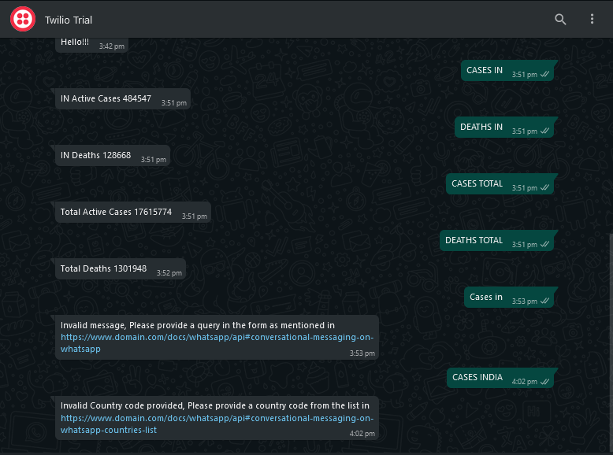

# COVID19_SAMPLE_API

COVID19API is a way to get latest info on Covid19 cases

## We use **celery** and **celery-beat** to periodically poll POSTMAN API to get cases info, process and store it into our **postgresql** database using **tortoise-orm**.

## We use **Fastapi** and **TWILIO's Python sdk** to serve the queries we get from the WHATSAPP BOT

## We use **ngrok** to provide an external api for tunneling web traffic to our Fastapi service

## We can query for info by issuing commands to our WHATSAPP BOT built using TWILIO API.

### CASES COUNTRY_CODE

### CASES TOTAL

### DEATHS COUNTRY_CODE

### DEATHS TOTAL

### Eg: CASES IN

### CASES TOTAL

## Sample image

## Steps to start the app

Navigate to the root of this repo after cloning onto your machine

### Run `docker volume create covid19dbvolume`

### Run `docker-compose up -d` starts the app

### Go to http://http://localhost:4040

### Copy the tunnel url provided by ngrok and add /api/v1/ to it

### Eg if the url at http://localhost:4040 is https://TESTNGROK.ngrok.io

### Add /api/v1/ to it to make

### https://TESTNGROK.ngrok.io/api/v1/

### Add the above url[https://TESTNGROK.ngrok.io/api/v1/] to https://www.twilio.com/console/sms/whatsapp/sandbox in WHEN A MESSAGE COMES IN section

### Query your WA BOT and get the response messages

## Contributing

Pull requests are welcome. For major changes, please open an issue first to discuss what you would like to change.

## License

[MIT](https://choosealicense.com/licenses/mit/)
